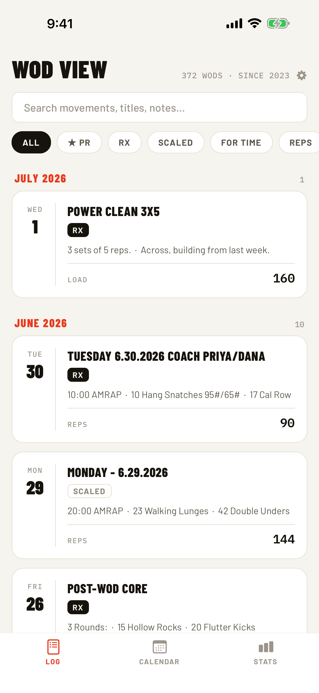
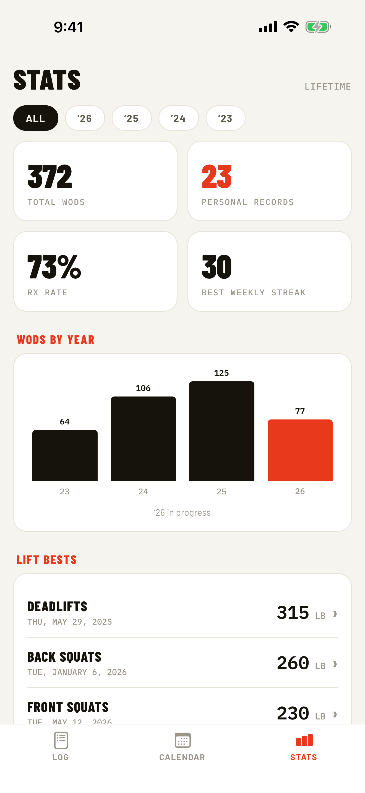
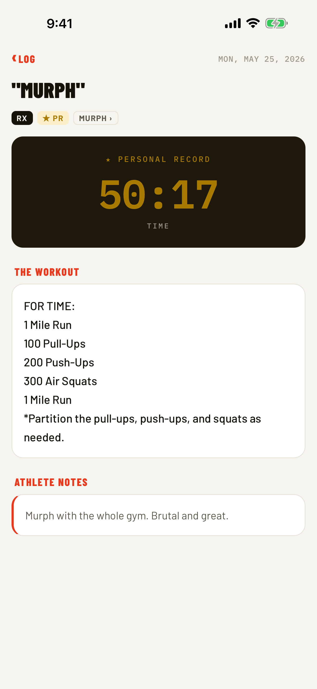

# WOD View

<p align="center">
  
</p>

<p align="center">
  <strong>Every rep. Every PR. Analyzed.</strong><br />
  A fast, private iPhone archive for the workout history you already own.
</p>

<p align="center">
  <a href="https://www.christophermark.me/wodview">Website</a> ·
  <a href="https://www.christophermark.me/wodview/support">Support</a> ·
  <a href="https://www.christophermark.me/wodview/privacy">Privacy</a>
</p>

WOD View turns a SugarWOD workout-history export into a searchable training log, calendar, and lifetime stats dashboard. Import a CSV on your iPhone and the app parses everything on-device—no account, server, analytics, ads, or subscription.

<table>
  <tr>
    <td align="center"></td>
    <td align="center"></td>
    <td align="center"></td>
  </tr>
  <tr>
    <td align="center"><strong>Find any workout</strong></td>
    <td align="center"><strong>See the long view</strong></td>
    <td align="center"><strong>Keep the full story</strong></td>
  </tr>
</table>

## How it works

1. Request your workout-history export from SugarWOD.
2. Save the CSV from the export email to Files on your iPhone.
3. Import it into WOD View. Your history is parsed and stored entirely on-device.

No export handy? Preview mode includes three years of deterministic sample workouts, so every screen can be explored before importing personal data.

## Screens

- **Log** — chronological feed of every workout, grouped by month, with free-text search (titles, descriptions, notes) and quick filters (PRs, Rx, Scaled, For Time, Reps, Load).
- **Calendar** — month grid of training days; gold days are PR days. Tap a day to see what you did.
- **Stats** — lifetime stat tiles, WODs-per-year chart (or per-month when a year is selected via the year filter), barbell lift bests, most/least-programmed movements, and log milestones.
- **Workout detail** — full whiteboard description, your score (with PR treatment), and athlete notes.

## Private by architecture

WOD View has no backend and no account system. Imported workout history never leaves the device, and the app includes no analytics, advertising, or crash-reporting SDKs. Clear the import in Settings or delete the app and the local data is gone. See the full [privacy policy](https://www.christophermark.me/wodview/privacy).

## Data

Personal workout data stays untracked:

- `data/workouts.csv` — the raw SugarWOD export (**gitignored**)
- `src/data/workouts.json` — generated, typed app data (**gitignored**)

To (re)import an export:

```sh
cp ~/Downloads/workouts.csv data/workouts.csv
npm run convert
```

The convert script also restores the line breaks SugarWOD strips from workout
descriptions and notes on export, using formatting heuristics.

## Development

```sh
npm install          # postinstall converts your CSV (or the committed sample) automatically
npx expo start --ios
```

Useful commands: `npm test`, `npm run typecheck`, `npx eslint .`, `npm run format`.
CI runs all four on every push.

In dev builds, a gear icon on the Log screen opens a debug settings screen where you can
import a SugarWOD CSV in-app and switch between the bundled and imported datasets.

## Movement detection sweep

Stats rely on the movement taxonomy in `src/lib/movements.ts` recognizing the gym's
programming vocabulary. To audit coverage against your archive (e.g. after importing a
fresh export):

```sh
npx tsx scripts/analyze-movement-coverage.ts   # --top 120 for more mined lines
```

It prints per-movement hit counts, rep-parse rates, and the unmatched description lines
where missing movements and spellings hide. To act on the findings, ask Claude Code to
"run a movement sweep" — the `/movement-sweep` skill (`.claude/skills/movement-sweep/`)
wraps the script with the full interpret-and-expand workflow: classify mined phrases,
widen patterns safely (never lose an existing match), and add synthetic-only regression
tests for every change.

Planned analytics features (benchmark pages, lift progression, year recaps, …) are
specced in [`docs/features/`](docs/features/README.md).
